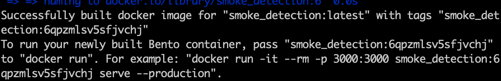
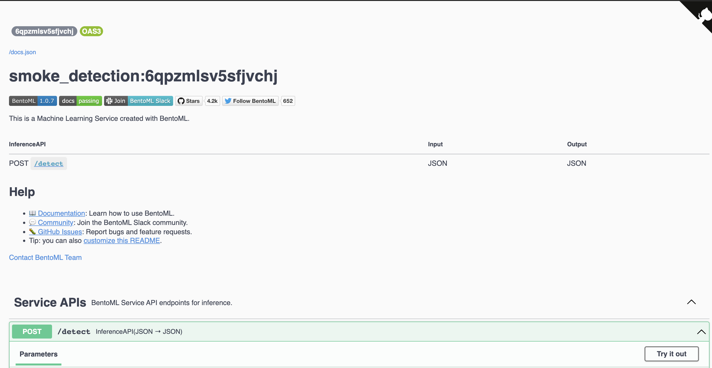
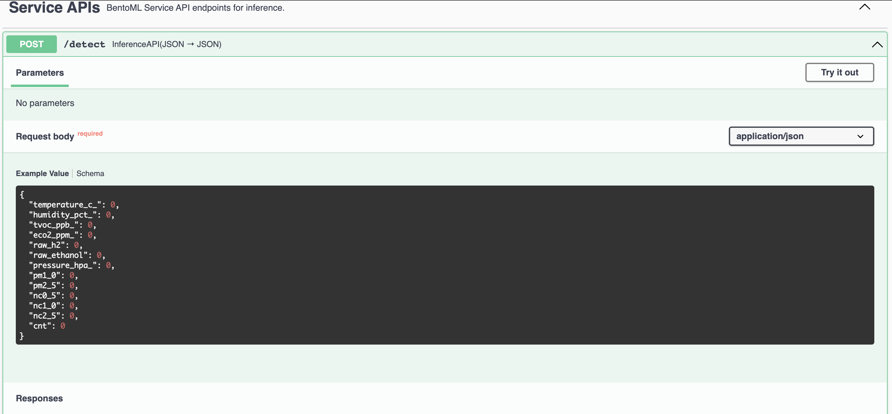

# MID TERM PROJECT (Smoke Detection Dataset)

This is mid term project for the [MLZoomCamp](https://github.com/alexeygrigorev/mlbookcamp-code/tree/master/course-zoomcamp) course [here](https://github.com/PatrickCmd/mlzoomcamp/tree/main/course-zoomcamp/projects) sponsored by [DataTalks.Club](https://datatalks.club/)


## Problem
Detect smoke with the help of IOT data and trigger a fire alarm. Use IOT data, train machine learning model to detect whether a smoke detector will give off a fire alarm in different scenerios, then deploy the model as web service.

## Dataset
The chosen dataset for this project is the Smoke Detection Dataset from [Kaggle](https://www.kaggle.com/datasets/deepcontractor/smoke-detection-dataset)

## Dataset description:

Collection of training data is performed with the help of IOT devices since the goal is to develop a AI based smoke detector device. Many different environments and fire sources have to be sampled to ensure a good dataset for training. A short list of different scenarios which are captured:

```
Normal indoor
Normal outdoor
Indoor wood fire, firefighter training area
Indoor gas fire, firefighter training area
Outdoor wood, coal, and gas grill
Outdoor high humidity
etc.
```

## EDA Notebook
See notebook for data cleaning, EDA and training of machine learning models [here](https://nbviewer.org/github/PatrickCmd/mlzoomcamp/blob/main/course-zoomcamp/mid-term-project/smoke-detection-notebook.ipynb#)


## Project Setup
clone the project from the repository
```
git clone https://github.com/PatrickCmd/mlzoomcamp.git
```

Change to project directory
```
cd mlzoomcamp/course-zoomcamp/mid-term-project
```

Setup and install project dependencies (uses pipenv for virtual environment)
```
make setup
```

Train and save the model. Uses [BentoML](https://docs.bentoml.org/en/latest/tutorial.html)
```
make train_save_model
```

Build a Bento
```
make bento_build
```

Create a detection web service locally
```
make serve
```

Or if you have [docker](https://www.docker.com/products/docker-desktop/) installed and setup on your machine, you can run the containerized service
```
make containerize
```

And then run the docker image from the above command
```
docker run -it --rm -p 3000:3000 smoke_detection:model-tag serve --production
```

Make sure to replace the `model-tag` with the tag from the containerize command



## Test the model service

Test the detection service locally in new terminal tab or window by running the test script below
```
make test
```

Or browse to http://localhost:3000/ in your web browser and test our the service with the `detect` endpoint






